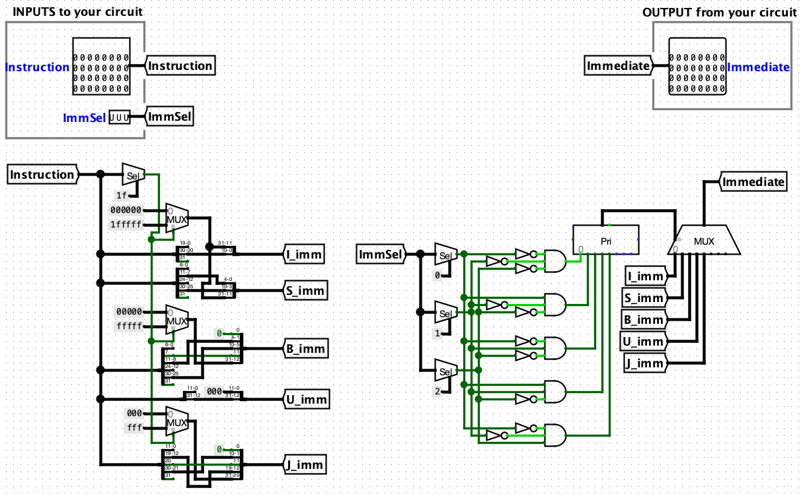

# CS61CPU

I made a CPU! Here's what I did:

- An ALU unit

  

- An register file

  
  
- A branch comparator

  

- A control logic unit

  

- A immediate number generator

  

- A Dmem Loader

  

- A Dmem Storer

  

Linker these units together

